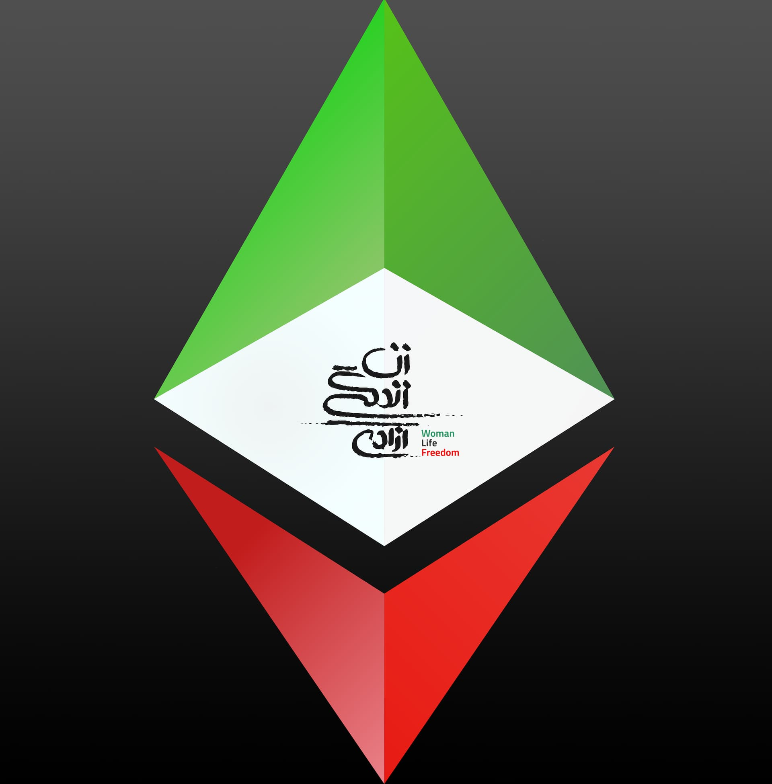

# eth conferences scholarship

*Original topic from 2023-10-15T00:06:31Z*

### Original Post
**Author:** root | 2023  
**Date:** 03-27 03:12:25 UTC | #1  

# ETH Conferences scholarship

Ethereum-run conferences are highly-regarded international events that attract professionals, students, developers, and enthusiasts from around the globe. It presents a unique opportunity for attendees to interact with and learn from some of the most innovative minds in the blockchain industry.

It is apparent that attending the Ethereum conferences and engaging with the community has been the most effective way for onboarding developers and enthusiast in this space. Devcon Scholars Program has been a global success, however, it has thus far lacked support for Iranian youth who are interested in attending, but need the financial support to be able to attend. 

This grant is designed toward Iranian people, (mostly students) who are eager to learn and attend Ethereum conferences and hackathons. This grant pool will go towards covering the cost of flights, accommodation, and conference registration fees for approved applicants.

There will be a working group around this grant to partner with different conference organizers to provide support and mentorship 

To be considered for the scholarship, applicants must go through a selection process that will be defined and announced shortly.  

If you are a conference organizer, an educational foundation, an educational organization or know any groups for nomination, please join the [public telegram](https://t.me/iranunchained) to propose and discuss more. 

Discussion Post: [forum.iranunchained.com](https://forum.iranunchained.com/t/eth-conferences-scholarship/13) .

---

### Reply #1
**Author:** root | 2023  
**Date:** 03-27 22:04:30 UTC | #2  

Deployed: 
https://www.iranunchained.com/grants/bafkreigale6eluhex3rc6c7ig2eulkazvoz5evwadpjh4fgkqo4uwfuxwu/details

---

### Reply #2
**Author:** ameen | 2023  
**Date:** 10-15 00:06:31 UTC | #3  

Created a proposal for distributing grant funds for Devconnect scholarships. 

https://admin.daohaus.fun/#/molochV3/0x1/0x81db04dfd741a765eae4696643c3bb558e7ac3b4/proposal/17

---

