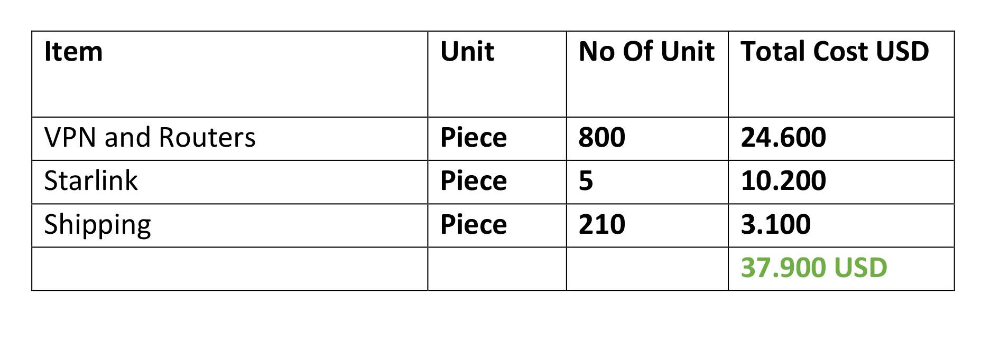

# free internet for iran achievements implementation objectives future

*Original topic from 2023-11-04T20:33:09Z*

### Original Post
**Author:** internet4i | 2023  
**Date:** 07-18 01:04:13 UTC | #1  

**What accomplishments has our group, achieved with the initial funding from Iran Unchained Fund?**

Our group, with the support of Iran Unchained, has taken significant steps towards circumventing internet censorship and striving to mitigate the impact of filtering in Iran. With the initial funding of $9,000 received from Iran Unchained, we embarked on a series of initiatives.

In the first phase, we aimed to provide individuals with secure VPN (Virtual Private Network) solutions while ensuring their safety. To achieve this, we purchased $20 gift cards from TorGuard, a renowned company in the field, enabling us to offer them the latest generation of VPNs called V2ray.

In the next stage, we procured over 100 cloud servers to establish high-speed and secure V2ray VPNs. These servers were deployed in the vicinity of internet experts, ensuring that they could access secure and fast VPN services.

Furthermore, we invested in routers, specifically GL-iNet routers with custom configurations provided by TorGuard. These routers were purchased and shipped to Iran, offering the advantage of plug-and-play functionality. Users only needed to connect these routers to their primary modems, allowing them to access the internet without any limitations.

Through our collaboration with Iran Unchained, we successfully sent over a hundred routers to various locations in Iran. These routers are currently assisting political activists and technology enthusiasts across the country, enabling them to enjoy unrestricted internet access.

One of the significant achievements we made with the assistance of Iran Unchained was finding an alternative company to replace Arvan Cloud. This company, called Sabz System, was established to provide internet services to specific organizations, such as the Islamic Revolutionary Guard Corps (IRGC), banks, and selected individuals. Their intention was to facilitate the government's agenda of silencing news coverage, committing crimes against humanity, and massacring the Iranian people by cutting off internet access.

With the revelation of this company's name, which was the result of tireless efforts and support from Iran Unchained, it has not yet faced sanctions or the same fate as Arvan Cloud. Currently, Sabz System has suspended its activities due to fear of being compromised. This is a significant victory for the Iranian people.

Another service we were able to provide with the help of Iran Unchained was the distribution of devices such as Raspberry Pi 4 and TD-LTE modems to enhance the coverage range of our satellite internet devices, specifically Starlink.

By sending these devices, we have significantly expanded the coverage area of Starlink. While previously it could provide internet access to a four-story building, it can now serve an entire street with over ten buildings. This demonstrates the efficient utilization of the existing Starlink devices in Iran.

Through our collaboration with Iran Unchained, we have made substantial progress in bypassing internet censorship and empowering individuals to access unrestricted information. These achievements have been instrumental in promoting internet freedom and human rights in Iran. We remain committed to furthering our efforts and exploring new avenues to combat internet censorship and ensure a free and open internet for all.

**What percentage of our pre-funding ideas has been implemented?**

We were able to practically implement 100% of the ideas we had for promoting internet freedom in Iran, thanks to the support of Iran Unchained. This support enabled us to think more robustly about solutions to circumvent internet restrictions in Iran and take practical actions beyond our initial expectations.

For example, sending routers to Iran was not initially part of our plans before receiving funding from Iran Unchained. However, after receiving the funding, it became one of the best initiatives that our group has undertaken thus far.

Upon receiving the funding, we were able to assist numerous groups and individuals who were working parallel to our cause. For instance, sending devices to increase the coverage range of Starlink was one of the collaborative efforts we engaged in.

The support from Iran Unchained has allowed us to expand our reach and actively contribute to the cause of internet freedom in Iran. We are grateful for the opportunity to bring practical solutions to fruition and empower individuals and organizations in their struggle against internet censorship. Moving forward, we are determined to continue our efforts and explore innovative ideas to ensure a free and open internet for the people of Iran.

**What was our main objective in obtaining funding from Iran Unchained Fund?**

Our group firmly believes that by focusing on increasing public awareness about the internet and providing services to bypass internet filtering and restrictions, as well as exposing and countering companies that directly collaborate with the Islamic Republic in cutting off and limiting the Iranian internet, we can render internet filtering in Iran ineffective.

In our pursuit of neutralizing internet filtering in Iran, we can hope that the Islamic Republic will be deterred from investing exorbitant resources into acquiring the latest technologies for internet censorship in the country.

From our perspective, this is not a long-term endeavor. We are confident that we can make internet filtering in Iran ineffective within a relatively short period of time. By employing strategic tactics and leveraging our expertise, we aim to empower the people of Iran to freely access information and communicate without censorship.

Our ultimate goal is to dismantle the barriers imposed by internet filtering and foster an environment where individuals can exercise their rights to information, expression, and privacy online. We are dedicated to this cause and will continue to work diligently to achieve a free and open internet for the people of Iran.

**What ideas do we have for the future?**

We are continuously brainstorming new ideas to bypass internet filtering and restrictions in Iran. Currently, our group's secure network encompasses a significant number of individuals, allowing us to provide internet freedom to a much larger audience than before. We are constantly looking towards the future, building upon our previous experiences and striving to maximize the potential we possess.

One of the valuable services we have provided, thanks to the collaboration with Iran Unchained, is the purchase of gift cards from TorGuard. These gift cards have enabled us to provide individuals with the latest VPN technologies without compromising their security. We intend to continue the practice of purchasing gift cards in the future.

By leveraging these gift cards, we can offer individuals a secure and efficient method to access the internet without limitations. We believe this approach is instrumental in expanding internet freedom and empowering individuals to exercise their right to unrestricted information and communication.

Another service that significantly contributed to circumventing internet filtering and restrictions in Iran was the provision of routers. These routers, with custom configurations from TorGuard, offered high-speed, unrestricted internet access to individuals. However, one drawback of these routers was their reliance on electricity, limiting their usage to home environments. But with the introduction of new generation GL.iNet routers, equipped with battery and SIM card capabilities, this issue can be resolved. Individuals can now enjoy unrestricted and high-speed internet access even outside their homes or workplaces.

We hope to secure funding from Iran Unchained in the next phase, allowing us to send more than 500 gift cards from TorGuard and over 100 routers to Iran. Additionally, we plan to provide several satellite internet devices from Starlink to our group members. Through this initiative, we aim to conduct research on Starlink and share insights with Starlink users in Iran regarding optimal utilization of these devices.

By expanding our efforts in these areas, we believe we can make a significant impact on internet freedom in Iran. We are committed to exploring new technologies, improving accessibility, and empowering individuals with the tools they need to navigate the internet without restrictions. Our vision is to create a more open and inclusive digital environment for the people of Iran.

**Description of the costs associated with our future ideas**

We have presented the costs for our ideas in the table below.

We estimate that we need approximately $40,000 to implement these ideas. We are confident that these expenses will address the internet restrictions for more than two thousand individuals.

**What is the timeline for implementing these ideas?**

We plan to put our ideas into action in less than four months. Our group is currently striving to achieve the necessary readiness to take action as quickly as possible.

We have already started selecting individuals for the distribution of routers, and the demand for gift cards from TorGuard is higher than anticipated, as usual.

We are ready to swiftly initiate our actions and take a significant step towards alleviating internet restrictions in Iran upon receiving the next round of funding from Iran Unchained.

---------------------

Our group started its work from the beginning of the women,life,freedom revolution in Iran, with the aim of improving the internet situation in the country. We worked actively for over 6 months without any support and achieved significant successes, including putting an end to the activities of Arvan Cloud Company, which directly contributed to internet restrictions in Iran.

However, prior to our acquaintance with Iran Unchained and their support for us, we had never been able to take practical steps towards directly liberating the internet in Iran. We had never been able to empower the people with unrestricted internet access.

It can confidently be said that the collaboration between our group and Iran Unchained was one of the defining moments in the history of internet freedom in Iran.

All the challenging days we went through without any support, considering our group's high potential, have been overshadowed and forgotten thanks to the comprehensive support from Iran Unchained.

Iran Unchained, as an independent group, has not only been our financial supporter but also the cornerstone of our organization, enabling us to successfully carry out our planned activities for the freedom of the Iranian people.

---

### Reply #1
**Author:** ameen | 2023  
**Date:** 11-04 19:51:19 UTC | #2  

Cross linking to the other Internet4i posts: https://forum.iranunchained.com/t/internet-freedom-for-iran/16/6

---

### Reply #2
**Author:** ameen | 2023  
**Date:** 11-04 20:33:09 UTC | #3  

Project updates from our Q3 2023 Report: https://twitter.com/UnchainIran/status/1714291746828697648

---

