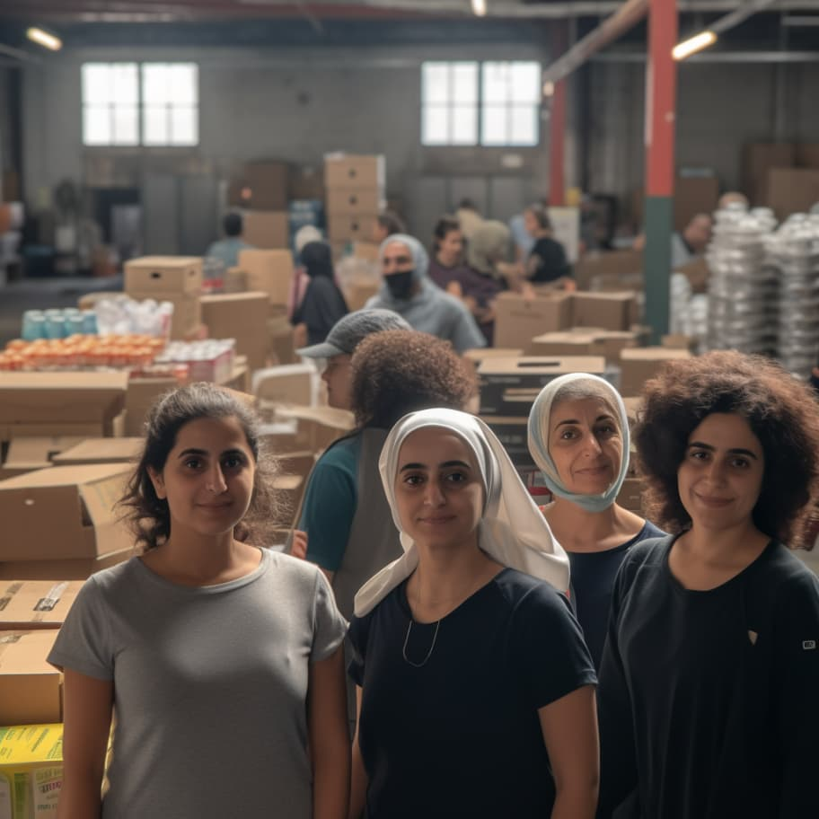

# humanitarian aid for iran

*Original topic from 2023-09-23T00:17:08Z*

### Original Post
**Author:** root | 2023  
**Date:** 03-27 02:59:07 UTC | #1  

# Humanitarian Aid For Iran

This grant is to support purchasing and distributing food, clothing, medical essentials, and other humanitarian aid materials on behalf of Iranians. The distribution of humanitarian aid to Iranians is exempted from U.S. sanctions under the [Iran General License E](https://home.treasury.gov/system/files/126/iran_gle.pdf).

Food prices in Iran have [soared ~70%](https://tradingeconomics.com/iran/food-inflation) on average over the last year. Prices for other essentials have gone up as well due to economic turmoil and international sanctions.

Funds raised will go towards humanitarian aid groups that have experience in procurement and distribution in Iran, including to retroactively reward allies who have been offering such support at their personal expense.

Some of the more established non-profits we are looking to support include:

* https://www.wfp.org/countries/iran-islamic-republic
* https://sharifngo.com/
* https://childrenofpersia.org/

To evaluate these non-profits, we are seeking to learn more about active aid initiatives as well as the breakdown of how donated funds are spent.

In addition to established charities, we are looking to support small-scale efforts that may not be as publicly visible but may potentially have greater impact.

If you have suggestions for good grantees who are currently supporting humanitarian aid for Iranians or have done great work already and deserve a retroactive reward, please comment below.

If you donate or have relevant expertise, please post in our [public telegram](https://t.me/iranunchained) group to request access to our Iran Humanitarian Aid working group.

---

### Reply #1
**Author:** root | 2023  
**Date:** 03-27 22:03:15 UTC | #2  

Grant Deployed: 
https://www.iranunchained.com/grants/bafkreiaayldpo7f3whoxspezqdzh6iotvkuqvzcmucnycfkkphfocfg5qy/details

---

### Reply #2
**Author:** ameen | 2023  
**Date:** 09-23 00:15:24 UTC | #3  

We finally found a contact—Roshan Future—to help provide humanitarian aid inside Iran. 

The grant will be used on a monthly care package that is primarily food, but also includes sanitary items. 

See an example care package below:

https://twitter.com/RoshanFuture_/status/1705270381685166497

---

### Reply #3
**Author:** ameen | 2023  
**Date:** 09-23 00:17:27 UTC | #4  

Grant proposal: 

https://admin.daohaus.fun/#/molochV3/0x1/0x81db04dfd741a765eae4696643c3bb558e7ac3b4/proposal/16

---

