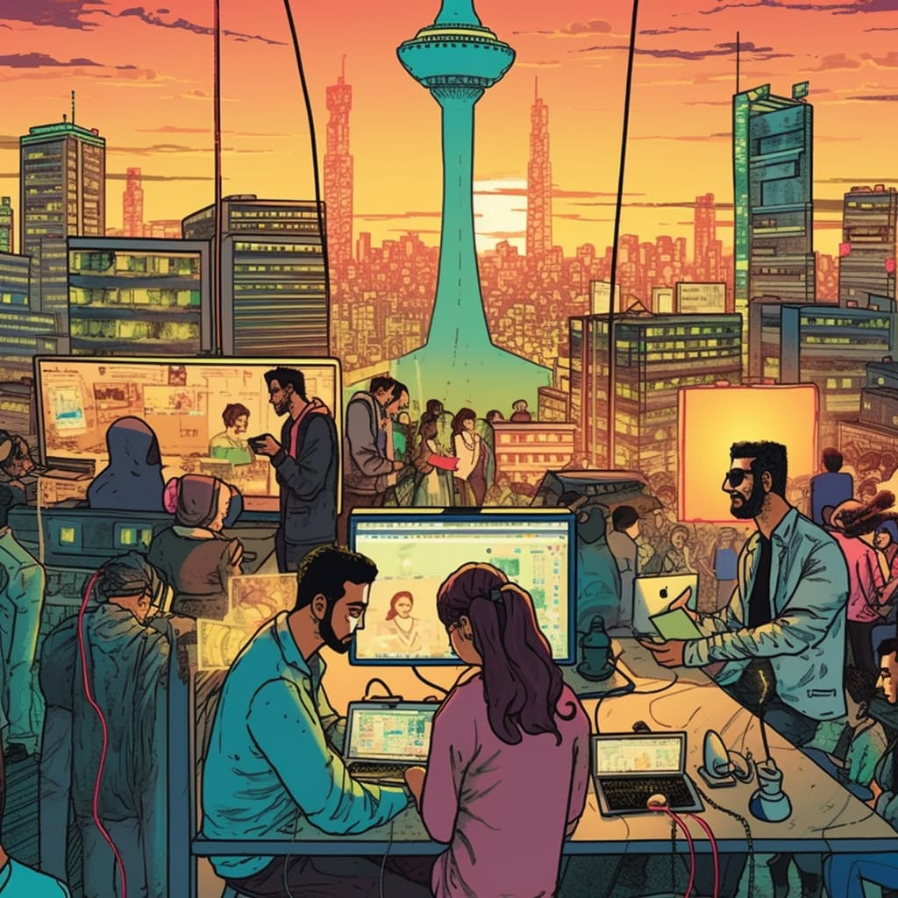

# internet freedom for iran

*Original topic from 2023-09-19T07:56:01Z*

### Original Post
**Author:** root | 2023  
**Date:** 03-27 03:01:01 UTC | #1  

# **Internet Freedom For Iran**

This grant is to support helping Iranians access the internet and online software services. Providing support to Iranians for internet freedom was recently explicitly [encouraged by the U.S Treasury](https://home.treasury.gov/news/press-releases/jy0974) with the publication of the [Iran General License D-2](https://home.treasury.gov/system/files/126/iran_gld2.pdf).

For context, internet in Iran has been shut down recently to prevent Iranians from coordinating around protests and from publicizing the injustices of the regime. For more information, please see the [statement by the U.S. State Department](https://www.state.gov/joint-statement-on-internet-shutdowns-in-iran/) as well as the excellent[ Amnesty International website](https://iran-shutdown.amnesty.org/) dedicated to the topic.

Funds raised will be used to purchase and distribute VPN vouchers, starlinks systems, and other general infrastructure to help Iranians stay connected to the internet. Funds will also be used to help sustain allies who have been offering such support at their own personal expense.

We are forming a working group of relevant experts and donors to determine the most impactful use of funds.

This grant was inspired by [Morteza Esmailpour’s fundraising campaign](https://twitter.com/esmailpour_m/status/1612832119755083778) on gofundme, which was shut down unceremoniously by gofundme in an example of sanctions over-compliance. We are actively seeking to make contact with Morteza and help facilitate his Internet Freedom fundraiser with this grant proposal. We are also happy to work with other Internet Freedom experts or simply use our best judgement to determine where the distribute the funds to maximize impact.

If you have suggestions for good grantees who are currently supporting Internet Freedom for Iranians or have done great work already and deserve a retroactive reward, please comment below.

If you donate or have relevant expertise, please post in our [public telegram](https://t.me/iranunchained) group to request access to our Internet Freedom working group.

---

### Reply #1
**Author:** root | 2023  
**Date:** 03-23 06:02:23 UTC | #2  

Just found this useful dashboard from [censoredplanet.org](https://censoredplanet.org/reports) project that shows which websites are filtered/censored in different countries, with a pretty good technical breakdown of the networks, etc: 

https://lookerstudio.google.com/u/0/reporting/91bed90c-585b-4575-a993-fc8597bc26bf/page/T33gB?params=%7B%22df62%22:%22include%25EE%2580%25800%25EE%2580%2580IN%25EE%2580%2580Iran%22%7D

---

### Reply #2
**Author:** gavers | 2023  
**Date:** 03-25 20:05:11 UTC | #3  

One potential concern with the proposal is the reference to retroactively rewarding allies who have been offering support at their own personal expense. While this could be a way to recognize and incentivize contributions to the cause, it's worth noting that retroactive rewards can be subject to bias and may not align with clear criteria for funding allocation. Therefore, it would be important to have a transparent and fair process for determining which allies are eligible for retroactive rewards.

---

### Reply #3
**Author:** root | 2023  
**Date:** 03-27 02:16:36 UTC | #4  

Thanks for the feedback, I changed the wording to "help sustain" the current positive initiatives. 

We also have a draft for retroactive funds that is in the discussion:  https://forum.iranunchained.com/t/discretionary-retroactive-fund/15

---

### Reply #4
**Author:** root | 2023  
**Date:** 03-27 22:04:52 UTC | #5  

Deployed: 
https://www.iranunchained.com/grants/bafkreifkzpfybx4jwupsuw4ek2h7w34om6bnsqfpgoxm7hlsmj6b4gg27y/details

---

### Reply #5
**Author:** root | 2023  
**Date:** 04-11 19:28:56 UTC | #6  

Round 1 funding candidate:

## Free internet for Iran

* Website: https://fifiran.net/
* Twitter: https://twitter.com/internet4i
* Instagram: https://www.instagram.com/internet4iran/
* Registered group, in the process to be an NGO
  * Based in Switzerland

Free Internet for Iran is a recently established group that consists of international lawyers, attorneys, activists, and IT experts.
The aim of this group is through legal means, to prevent the regime’s proxy companies outside of Iran from filtering, restriction, and complete internet shutdown for the people in Iran. The regime would not be able to conduct an internet shutdown and severe restrictions without assistance from companies outside the country. They create external links/infrastructure so when the government shuts down the internet for the people, the governmental organizations and banks won’t run into connectivity issues.

Our mission is to locate these companies, operative outside Iran, and to legally stop their operations based on the “Free Flow of Information Act” in developed countries. This is done through intelligence gathering, legal lobbying, and reporting fake shell companies to international bodies:

* Research & Data gathering
* Intelligence data gathering and insider information
* Data Verification, tracing and validation
* Operations and human resource costs
* International legal & court filing costs

---

### Reply #6
**Author:** root | 2023  
**Date:** 04-26 03:33:10 UTC | #7  

Proposal sent for voting to _Transfer to working group multisig_: https://admin.daohaus.fun/#/molochV3/0x1/0x81db04dfd741a765eae4696643c3bb558e7ac3b4/proposals/6

---

### Reply #7
**Author:** root | 2023  
**Date:** 05-09 15:53:33 UTC | #8  

Update: The above proposal has been approved. 

We finalized the recipient address and distributed the funds to internet4i. 
- Transaction: https://etherscan.io/tx/0xa7d3fa3f90982e96d8f0bf7e43a10826f6338c8ccaf81a0b3932ad2e792c582a

This was the first round for Internet Freedom for Iran. We will be continuing fund raising and offer support under this category. 

LFG!

---

### Reply #8
**Author:** ameen | 2023  
**Date:** 05-10 20:09:13 UTC | #9  

Round 2 funding candidate:

## Game of Trust

> *The Game of Trust aims to create a secure community of Iranian individuals who oppose the current regime while keeping everyone’s identity anonymous, enabling communication, discussions on diverse topics, and coordination.*

Github: https://github.com/gameoftrust/
Explainer: https://telegra.ph/Game-of-Trust-04-26
Bot Link: https://t.me/irgotbot

More info in their forum post below:

https://forum.iranunchained.com/t/game-of-trust-a-web-of-trust-between-iranian-protesters/48

---

### Reply #9
**Author:** root | 2023  
**Date:** 06-04 11:44:15 UTC | #10  

Since enough funds are gathered in this grant to support the second candidate, we have initiated the transfer transaction from the grant safe to the working group multisig: https://admin.daohaus.fun/#/molochV3/0x1/0x81db04dfd741a765eae4696643c3bb558e7ac3b4/proposals/9

We'll update when finalized.

---

### Reply #10
**Author:** root | 2023  
**Date:** 06-08 10:59:52 UTC | #11  

The funds for round 2 has been released to the candidate "Game of Trust":  https://etherscan.io/tx/0x33fccf4fcd6d598a6f27d09dfee7eb934fdfab94a0bb426085131a3ddeaeb95e

Congratulations to the Game of Trust team and hope to see the project updates coming soon.

---

### Reply #11
**Author:** root | 2023  
**Date:** 07-19 19:25:12 UTC | #12  

[quote="root, post:6, topic:16"]
Round 1 funding candidate:

## Free internet for Iran

* Website: [https://fifiran.net/ ](https://fifiran.net/)
* Twitter: https://twitter.com/internet4i
* Instagram: [https://www.instagram.com/internet4iran/ ](https://www.instagram.com/internet4iran/)
[/quote]

Update from our grantee internet4i. They have achieved great objectives with the initial grant they have received, which you can read more on our https://forum.iranunchained.com/t/iranunchained-first-quarterly-update-q2-2023/58 and their posted update: https://forum.iranunchained.com/t/free-internet-for-iran-achievements-implementation-objectives-future/63 .

Their new proposal is a candidate for ongoing round [(Round 3)](https://www.iranunchained.com/grants/bafkreifkzpfybx4jwupsuw4ek2h7w34om6bnsqfpgoxm7hlsmj6b4gg27y/details) of Internet Freedom For Iran grant.

---

### Reply #12
**Author:** root | 2023  
**Date:** 07-25 19:14:43 UTC | #13  

Withdrawal proposal for round 3 to WG wallet sent to the DAO, please vote: https://admin.daohaus.club/#/molochV3/0x1/0x81db04dfd741a765eae4696643c3bb558e7ac3b4/proposals/10

---

### Reply #13
**Author:** root | 2023  
**Date:** 08-02 05:30:51 UTC | #14  

Proposal is passed and the funds are in escrow in the Working Group multisig to be released in the next few days,

Thank you everyone, this is the end of round 3 of Internet freedom for Iran. Please feel free to nominate candidates for the next round.

---

### Reply #14
**Author:** ameen | 2023  
**Date:** 09-19 07:56:01 UTC | #15  

We have submitted a Round 4 proposal on behalf of https://www.molethewall.com/. 

Proposal Link:

https://admin.daohaus.fun/#/molochV3/0x1/0x81db04dfd741a765eae4696643c3bb558e7ac3b4/proposal/13

Forum Post Link:
https://forum.iranunchained.com/t/censorship-circumventing-vpn/65

---

