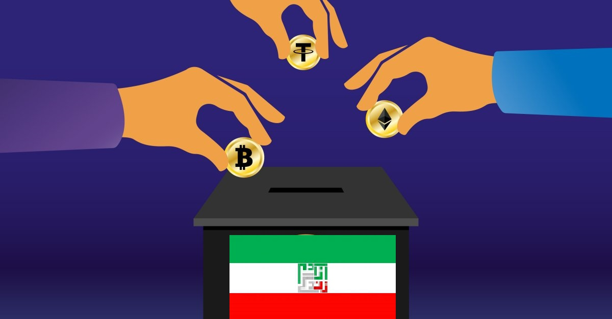

# iran dao a peer to peer dao charity

*Original topic from 2023-04-12T17:58:45Z*

### Original Post
**Author:** Anna | 2023  
**Date:** 04-12 17:58:45 UTC | #1  

In Iran, the government interferes in all decisions and activities of the people. Even the government decides  people donate to which charity and how charities spends these helps. The government considers itself responsible for collecting and distributing charitable donations; And it even closes the accounts of individuals and institutions that people trust . (For example, closing the accounts of Ali Daei (a football player) in the  earthquake in the Kermanshah city).

  At the same time, Iranians are reluctant to donate to government charities because they do not trust them.On the other hand, due to heavy economic sanctions,Sending charitable donations from outside Iran is very difficult and limited. The goal of the :IRAN DAO"  project is to create a simple, automated peer-to-peer charity  by a smart contract on the blockchain platform. The purpose of this charity is to send quick and transparent donations (on a person-to-person basis) without the involvement of governments. People can work in this charity with real identity or anonymously. In order to prevent fraud or other unauthorized uses, the scope of sending donations is considered small. The mechanism and operation of this charity is as follows:

 

  Charity is a site connected to a smart contract. On the site, there are three roles : donor, recipient and local validator (a volunteer person who knows how the site works and the basics knowledge of cryptocurrency transactions) and  also there is a multi-signature wallet for emergency cases and other decisions.

The process of sending help can be activated in three ways:

1- The first method:

  The local validator record  the characteristics and the reason whya person or family needs help. A donor volunteer (anonymous or with a real identity, in Iran or outside Iran) undertakes to send the aid. With the help of a local validator, the cryptocurrency is converted into rials or goods and  send to recipient. (This charity prefer  that the amount of donations is limited but over a long period of time. For example, an orphan child's education is paid during the school years, but a small amount of a few hundred dollars is paid monthly).

 2- The second method :

 the recipient  record her/his  situation and the reason for asking for help and announces his wallet address,( or trusted volunteers create a profile for a person who does not have physical or technical ability.)

In the next step, for validation and research, the aid recipient's request is randomly sent to two local validators living in the same city or region. (Regions are registered as geographical codes in smart contract or charity sites).

A local validator is a person who voluntarily cooperates with the site and confirms or rejects the validity of the recipient's request with local research. Each validator can cover a radius of one hundred kilometers from his place of residence (in Iran, communication between people and individuals is strong, and oral investigations and verification of requests are easily done)

In fact, the local validator is the person who determines whether the request for help from the user is genuine or fake with anonymous local research. It is voluntary work and is unpaid. Getting help is conditional on being approved by two local verifiers. These two validators are unaware of each other's  and therefore cannot influence each other's decisions.

  In cases where the recipient is technically unable to receive assistance in the form of cryptocurrency, with the agreement of both parties, the local validator undertakes the task of delivering the assistance. Considering the openness of the communication between the recipient and the donor, as well as the transparency of cryptocurrency payments, the level of honesty of the validator can be examined for providing help.

 In a toturial document on the site, users are taught this practical guide so that they can see the actual amount of donation  that has been sent to their wallets.

Note: It may be decided that a  small amount of money will be paid to the local verifiers to compensate them for their activities.

Note: In order to prevent abuse and fraud, the number of people covered by each validator is limited to a maximum of a few people(at most three to five case), and the assistance will be monthly and limited.

  (It is necessary to explain that in most cases, helping poor people is like a torrential rain in the desert, which is short and intense, and  this charity prefer to help people in small amounts but in the long term to have a real effect on improving the living conditions or grow .)

3-The third method:

In natural disasters such as floods or earthquakes, which suddenly cause problems for many people. The charity smart contract wallet is used to receive public donations and the method of sending donations is as follows:

1- Aids cannot be withdrawn until three months after the disaster. (In these situations, many of the real needs remain unanswered because a lot of  donation  is spent  in the first days of  disasters). Three months after the event (due to moving away from the emergency and emotional atmosphere)  Part of the assistance (but not all)  is sent to the wallet of the local validators of the same region, and after submitting the performance report and getting confirmation  some of the aid is released and sent to the account of the local validator again . And this process is repeated several times. It is suggested that the aids be sent to the local validators in 12 monthly steps (that is, up to one year after the incident).

 Basic decisions (like announcing the occurrence of the disaster and its date , confirming the local validators of that particular area, and sending the aid and...)  is made by a multi-signature wallet including the main charity funders and known trusted  volunteers.

---

