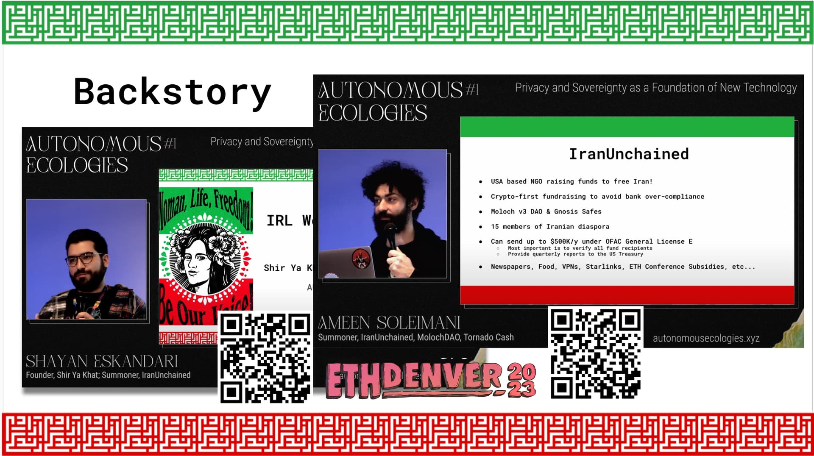
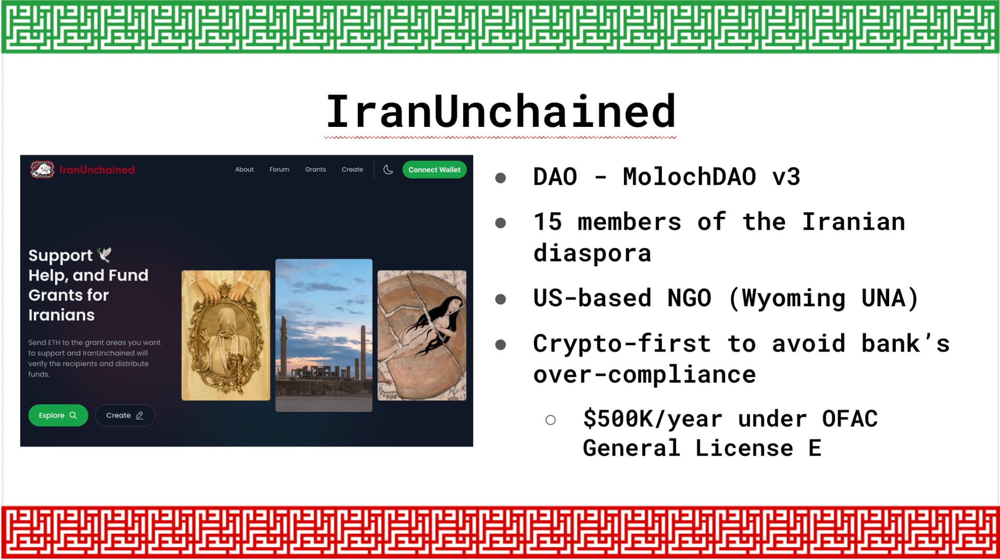
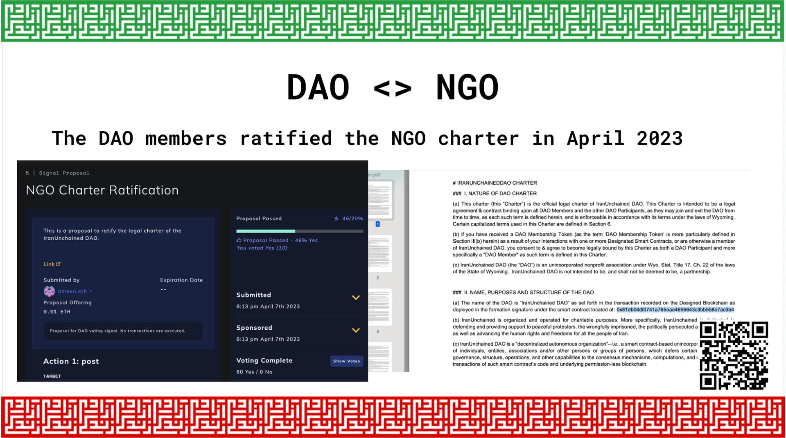
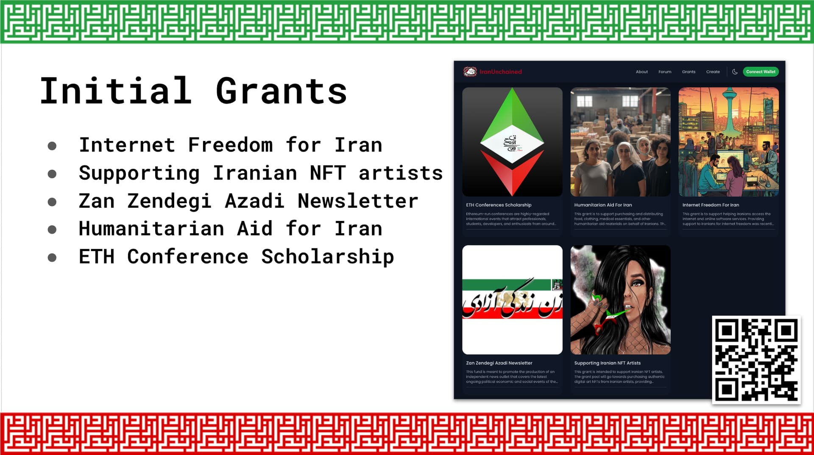
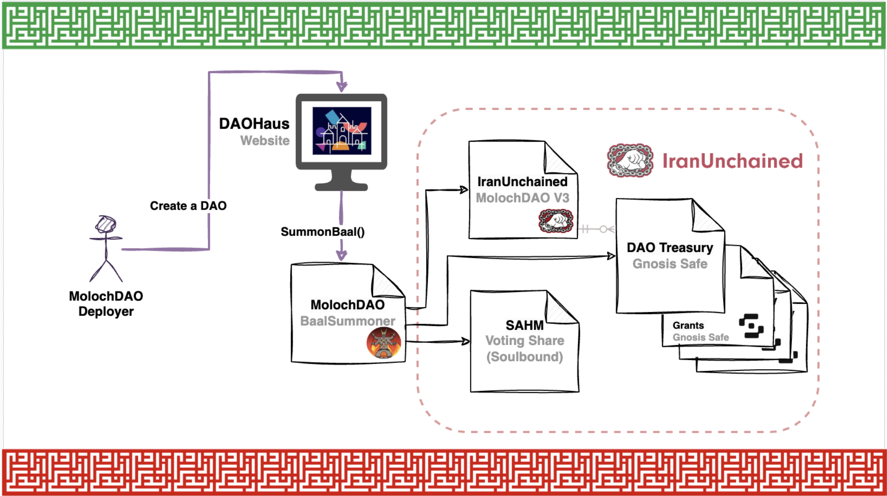
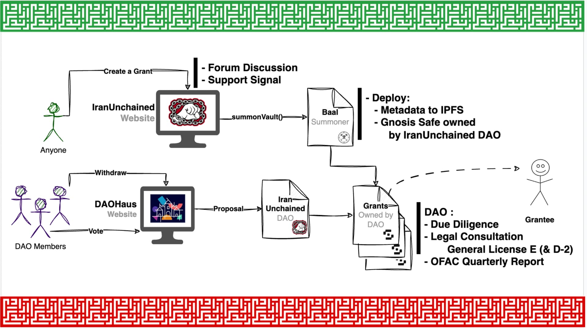
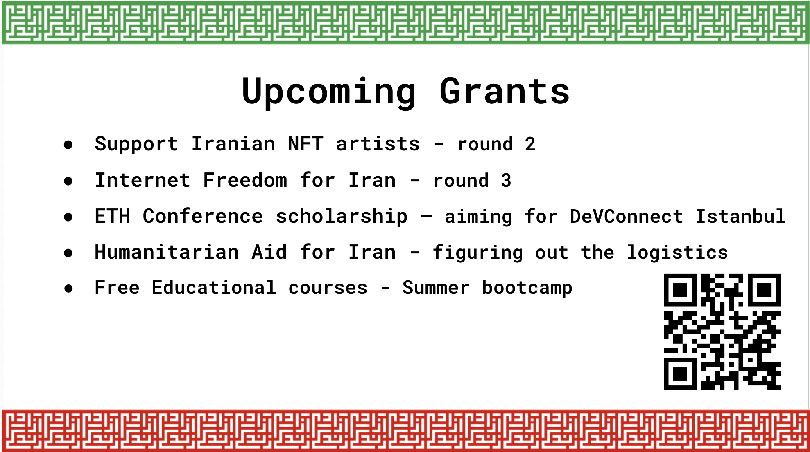
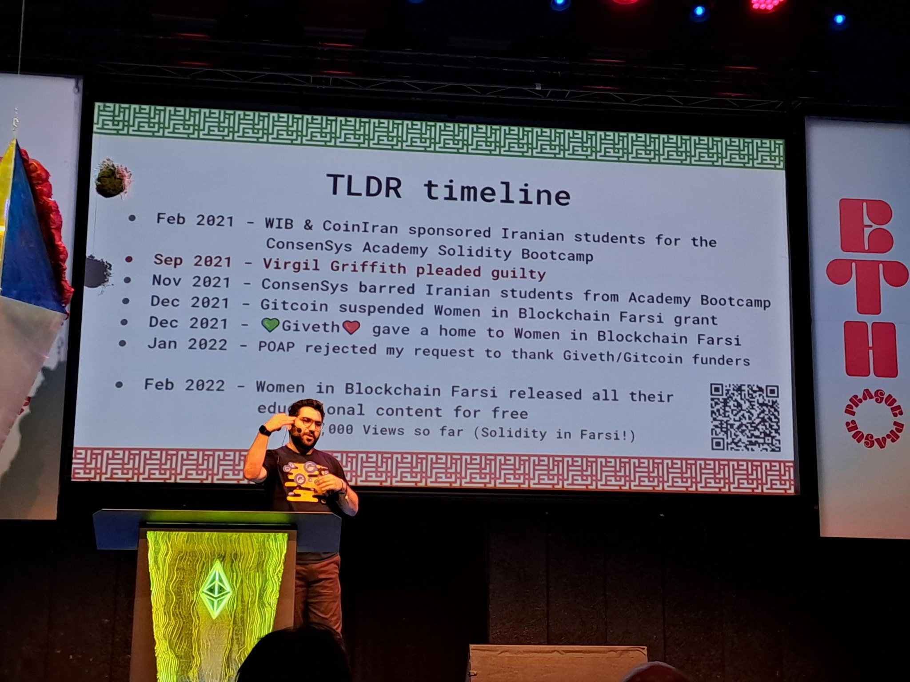

# iran unchained ngos meet daos ethprague june 2023

*Original topic from 2023-08-21T17:49:41Z*

### Original Post
**Author:** root | 2023  
**Date:** 08-21 17:49:41 UTC | #1  

> It was a pleasure presenting IranUnchained progress at [EthPrague](https://ethprague.com/). This is an unrolled version of the original Twitter [thread](https://twitter.com/sbetamc/status/1670432342400180224).

Here’s the recording of my talk, but also read further for the highlights:

https://www.youtube.com/watch?v=dO_jiwVjkcI
[Iran Unchained -- NGOs meet DAOs / Shayan Eskandari](https://www.youtube.com/watch?v=dO_jiwVjkcI)

-- -

# Backstory
I start my talk with a recap:

- In March 2023 at EthDenver, we announced Iran Unchained ([@UnchainIran](https://twitter.com/UnchainIran)) for the first time.We shared our ideas on how to fundraise compliantly for Iranians.
   - [Iran Unchained - Web3 meets the Iranian Revolution [ETHDenver]](https://www.youtube.com/watch?v=x0Gkae0MyG4)
   - [Ameen Soleimani - IranUnchained [Autonomous Ecologies #1]](https://www.youtube.com/watch?v=gKl941HbmPM)
 
- I expand on the uphill battle we've been fighting with the sanctions over-compliance within the web3 space, even amongst educational and grants platforms.
   - [Shayan Eskandari - IRL Web3 and Sanctions [Autonomous Ecologies #1]](https://www.youtube.com/watch?v=G2_MJtbSe1s)

# IranUnchained NGO

We explain how Iran Unchained is set up—it uses a novel NGO and DAO hybrid structure.

The NGO points to the DAO and the DAO ratified the NGO charter through an onchain vote.

We started by proposing 5 grants as the proof of concept to understand the compliance requirements and challenges.

So far we've sent out ~$40K and it's just the beginning...

# Geek Time! 🤓

IranUnchained under the hood is a MolochDAO V3 and each grant fund is a Gnosis Safe smart contract owned by the DAO.

You can see the full workflow in the images below and the short explanation in my talk.

# Looking ahead 👀

We'll be doing more grants in support of Woman, Life, Freedom in Iran.

Please join us on our [forum](https://forum.iranunchained.com/) and propose ideas you might have.

Also, please donate on our [website](https://iranunchained.com)!

------

Thank you

---

