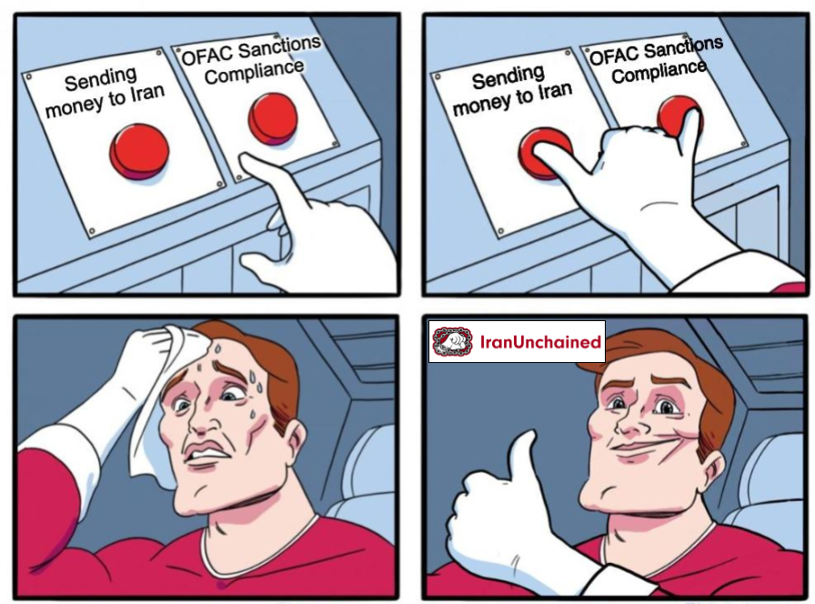

# iranunchained first quarterly update q2 2023

*Original topic from 2023-08-21T17:49:22Z*

### Original Post
**Author:** root | 2023  
**Date:** 08-21 17:49:22 UTC | #1  

> This topic was originally posted as a [Twitter thread](https://twitter.com/UnchainIran/status/1676276937550086144). 

We're proud to announce our first quarterly update!

- We sent $50K in grants, mostly to Iranians in Iran.
- We are submitting our first OFAC quarterly report.

Read on for 🧵👇
- ❤️‍🔥 a summary of our grantees
- 🤓 what we learned
- 🤝 how you can help

----

# Summary of Our Grantees

## Internet4i
Our first grant for [Internet Freedom for Iran](https://forum.iranunchained.com/t/internet-freedom-for-iran/16) was awarded to [@internet4i](https://twitter.com/internet4i)!

We are proud to support activists using legal means to disrupt internet censorship on Iranians, and also groups providing censorship-resistance internet infrastructure!
- https://twitter.com/UnchainIran/status/1655970794575634432

We're proud of internet4i for taking an early public stand against "Arvan Cloud", a tech company assisting the Islamic Republic with Internet censorship.

Their activism & legal pressure was vindicated when the @USTreasury imposed sanctions on Arvan Cloud!
- https://twitter.com/internet4i/status/1667191992348991488

The internet4i group has also been actively delivering VPNs & VPN-enabled routers to help Iranians accessing the internet.

Great work @shayanebn & team!
- https://twitter.com/internet4i/status/1667522911152795648

## Supporting Iranian NFT Artists

We are also proud to [support Iranian NFT artists](https://forum.iranunchained.com/t/supporting-iranian-nft-artists/11)!

We spent $20K+ over 2 rounds to curate a DAO-owned collection of our favorite art from Iranian artists.

See round 2 highlights in the thread below 🧵🖼️👇
- https://twitter.com/UnchainIran/status/1664038669026484226

You can also see our Foundation Portfolio for IranUnchained owned NFTs: 
https://foundation.app/0xDe1E21B33a6E11810f8321409d80b55EcC645E4a

We actually got 400+ NFT art submissions for our round 2 grants!

Check the replies to the QT to see some of the stunning art submitted 🧵🖼️👇
- https://twitter.com/UnchainIran/status/1645869081403465729

Thank you [@_r0yart](https://twitter.com/_r0yart) [@Najvasol](https://twitter.com/Najvasol) [@ThessyMehrain](https://twitter.com/ThessyMehrain) [@sbetamc](https://twitter.com/sbetamc) [@ameensol](https://twitter.com/ameensol) for curating ✌️

## Zan Zendegi Azadi Newsletter
Another grantee was [ZZANewspaper](https://forum.iranunchained.com/t/zan-zendegi-azadi-newsletter/12), a daily revolution newspaper operating in Iran.

Documenting the history of the #WomanLifeFreedom revolution is incredibly high stakes journalism, with the entire team operating anonymously.

Great work ✊
- https://twitter.com/sbetamc/status/1670432358632243200

## Game of Trust
Last but not least, our second [Internet Freedom for Iran](https://forum.iranunchained.com/t/internet-freedom-for-iran/16) grantee was the ["Game of Trust" project](https://forum.iranunchained.com/t/game-of-trust-a-web-of-trust-between-iranian-protesters/48).

They are working on a social trust network that uses Ethereum addresses as the bedrock of a web-of-trust, which can be used to secure anonymous comms.

---- 

# What We Learned

In June at [EthPrague](https://ethprague.com/) our founding member Shayan Eskandari ([@sbetamc](https://twitter.com/sbetamc)) was invited to present updates on our DAO formation & initial grants.

We appreciate the opportunity to share how we got here & what we have learned!

Watch his talk for the full story so far!

https://forum.iranunchained.com/t/iran-unchained-ngos-meet-daos-ethprague-june-2023/56

[Iran Unchained -- NGOs meet DAOs / Shayan Eskandari
](https://www.youtube.com/watch?v=dO_jiwVjkcI)

To get here, we learned a great deal about OFAC sanctions & compliance.

Please read our legal primer 📚

- 🫂 General License E -> rules for organizations
- 🛰️ General License D-2 -> internet freedoms
- 🎨 Berman Exemptions -> information materials (art)

https://medium.com/@iranunchained/iran-aid-a-legal-primer-ede9e8f4826d

----

# How You Can Help

With our first successful grants, Now we are looking for:

- 💸 donors to support our existing and new grantees
- 🔍 suggestions for promising new projects to support
- 🤝 intros to Iranian activist groups interested in our compliant fundraising tools!
   - https://twitter.com/UnchainIran/status/1637854733246537730

In addition to follow on grants for our existing grantees, there are several new grants we plan to support:

👇👇👇 
https://www.iranunchained.com/

## ETH Conferences Scholarship 🦄

As part of [ETH Conferences Scholarship](https://forum.iranunchained.com/t/eth-conferences-scholarship/13) grant, we to aim to bring the Ethereum community and Iranian web3 community closer together.

The first round of this grant is focusing on [EFDevconnect](https://devconnect.org/) Istanbul.

https://www.iranunchained.com/grants/bafkreigale6eluhex3rc6c7ig2eulkazvoz5evwadpjh4fgkqo4uwfuxwu/details

## Free Education in Farsi 👩‍💻

We are also excited to support [@crypt0zan](https://twitter.com/crypt0zan) & [@coiniranacademy](https://www.coiniran.academy/) for the [summer 2023 cohort](https://twitter.com/coiniranacademy/status/1675996771347050497) of their [Free Online Solidity Course](https://forum.iranunchained.com/t/free-education-in-farsi-grant/52) in Farsi.

They are aiming for 1,000+ Farsi Solidity students! 🤗
https://www.iranunchained.com/grants/bafkreiay66n6yxo2rdacyyct74grjqny7d6ndnpvgkfpg6ncbxsuavulce/details

More information on their course details in Farsi:
https://smartcontract.coiniran.com/t/topic/5637

## Humanitarian Aid For Iran 🙏

We have ~$10K ready to send towards [humanitarian aid grants](https://forum.iranunchained.com/t/humanitarian-aid-for-iran/14).

We are actively looking for humanitarian groups inside Iran to support.

Suggestions welcome!

https://www.iranunchained.com/grants/bafkreiaayldpo7f3whoxspezqdzh6iotvkuqvzcmucnycfkkphfocfg5qy/details

-----

Thank you for joining us on this journey!

We're excited to grow our network of grantees, donors, and friends ❤️‍🔥
- https://twitter.com/UnchainIran/status/1637854714258948096

#MahsaAmini

---

