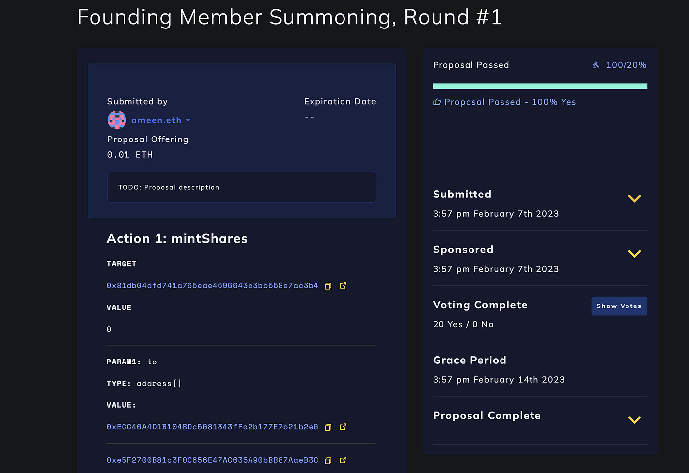
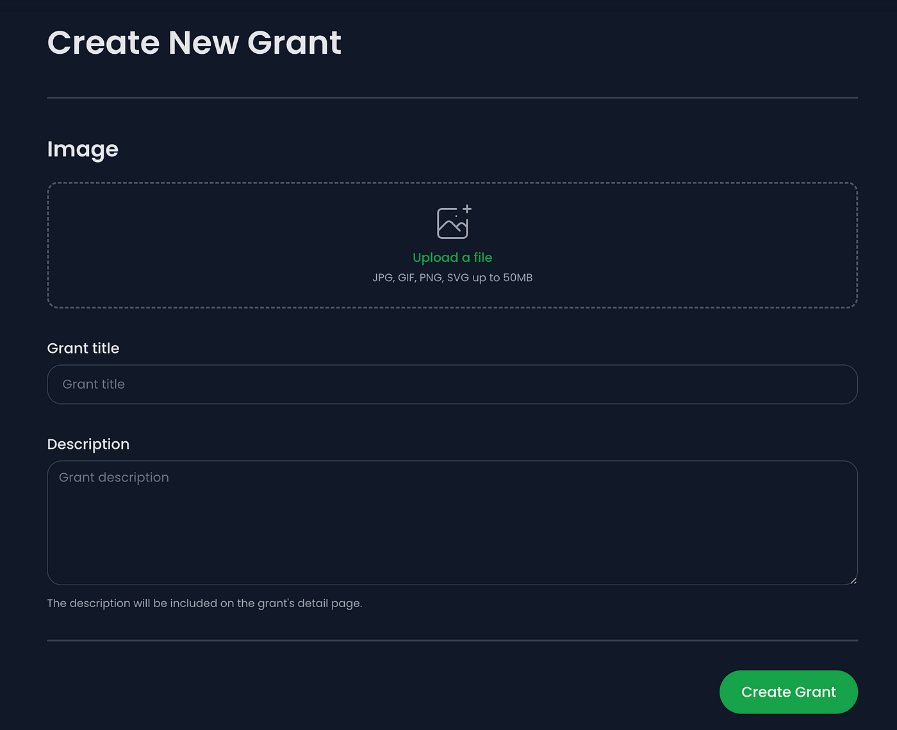

# iranunchained operations overview

*Original topic from 2023-03-16T23:42:06Z*

### Original Post
**Author:** root | 2023  
**Date:** 03-16 23:47:25 UTC | #1  

[|700x227](attachments/9bf3cc8ab73f0600636ed898b7db1e2d99fe6e2c.png)

# IranUnchained: Operations Overview

*IranUnchained is a new NGO raising funds to free Iran.*

# Introduction

A few weeks ago, we published our [Iran Aid: Legal Primer](https://medium.com/@iranunchained/iran-aid-a-legal-primer-ede9e8f4826d) to share our research into providing legally compliant aid to Iran. Our most important discovery was that unlike for individual remittances, **there is no explicit requirement that NGOs fundraise and send donations through banking institutions**. In light of this, we have decided to fundraise and send donations in crypto, and use crypto tools to organize our operations.

This document will explain our organizational structure, both legally and in terms of how we conduct our fundraising operations using crypto tools.

We cover the structure of our **“Decentralized Autonomous Organization” (DAO)**, a program that lives on the Ethereum blockchain and governs the rules of our organization, including managing membership and authorizing the transfer of funds.

We also cover the structure of the **IranUnchained.com** fundraising website, and how it connects to our DAO.

# Legal Structure

We chose to organize our NGO as an Unincorporated Nonprofit Association (UNA), based in Wyoming. Wyoming has recently [passed laws](https://www.jdsupra.com/legalnews/wyoming-amends-dao-legislation-enabling-2457236/) recognizing DAOs as legal entities, and so is a suitable home for our association. It suits our needs for having fluid, digital-first membership without needing additional paperwork, as well as liability protection for the members, especially for the actions of other members. Here are some excerpts from our charter:

> *I*ranUnchained DAO (the “DAO”) is an unincorporated nonprofit association under Wyo. Stat. Title 17, Ch. 22 of the laws of the State of Wyoming. IranUnchained DAO is not intended to be, and shall not be deemed to be, a partnership.

Our organizing principles:

> IranUnchained is organized and operated for charitable purposes. More specifically, IranUnchained is dedicated to defending and providing support to peaceful protesters, the wrongfully imprisoned, the politically persecuted and their families, as well as advancing the human rights and freedoms for all the people of Iran.

Our use of a DAO to manage governance:

> IranUnchained DAO is a “decentralized autonomous organization” — i.e., a smart contract-based unincorporated association of individuals, entities, associations and/or other persons or groups of persons, which defers certain aspects of the governance, structure, operations, and other capabilities to the consensus mechanisms, computations, and data storage and transactions of such smart contract’s code and underlying permission-less blockchain.

For more information, please read the full charter:

https://iranunchained.com/charter.pdf

# DAO Structure

DAOs are a novel democratic structure that allow members to coordinate by voting, and can operate without depending on central leadership.

The IranUnchained DAO is using the [Moloch v3](https://github.com/HausDAO/Baal) DAO smart contracts to manage its governance and operations.

The initial 12–15 (TBD) founding members have all been granted 10 *shares*, which can be used to vote on proposals. The shares are [*soulbound*](https://vitalik.ca/general/2022/01/26/soulbound.html)*,* which means they can not be transferred. Proposals must be submitted and voted on in order to create new shares, to remove shares from existing members, and to transfer funds under the DAO’s control.

Proposals have a 5 day *voting period* during which the members can vote YES or NO, which is followed by a 2 day *grace period* before passing proposals are executed.

Quorum for the DAO is set to 20%, which for our purposes means that at least 20% of the shareholders must vote YES for a proposal to pass.

Shareholders can *delegate* their voting power to others to vote on their behalf, without giving up control of their shares, and can revoke their delegation at any time.

Members can also voluntarily exit the DAO at any time, destroying their shares in the process.

In the event of an emergency (for example, a proposal passes to transfer funds to the wrong address), the members can trigger a *decentralized veto* if more than 20% of them exit the DAO at the same time, before the proposal passes. The remaining members will be able to regroup, re-invite the members who exited, and submit the fixed proposal for voting once again.

The DAO parameters defined above (voting period, grace period, quorum, decentralized veto threshold) can all be updated by DAO proposal as well.

## DAO Deployed Addresses

IranUnchained DAO contracts (On Ethereum mainnet):

* [Moloch v3: DAO governance module address](https://etherscan.io/address/0x81db04dfd741a765eae4696643c3bb558e7ac3b4)
* [Safe: DAO treasury address](https://etherscan.io/address/0xde1e21b33a6e11810f8321409d80b55ecc645e4a)
* [SAHM: DAO voting shares address](https://etherscan.io/address/0xe7a74474af2e28d921a15d1724ca66f55ae09119)

## DAO User Interface

The [DAO website](https://admin.daohaus.fun/#/molochv3/0x1/0x81db04dfd741a765eae4696643c3bb558e7ac3b4) shows the members of the DAO, their shares, and the status of all proposals, including those being actively voted on. The website can also be used by members to submit new proposals, vote on existing proposals, and exit the DAO.

For example, pictured below is our first proposal for creating shares for several of the founding members of IranUnchained.

https://admin.daohaus.fun/#/molochv3/0x1/0x81db04dfd741a765eae4696643c3bb558e7ac3b4

# IranUnchained.com Fundraising Structure

The typical setup for non-profit fundraising is for a group to fundraise for a general cause area, but without providing donors the means to decide on what portion of their donation goes to which specific causes. Unless the group has a narrow focus, it will hard for the donors to know exactly where their funds are going.

Non-profit DAOs have historically done slightly better. Despite still raising one big pool of donor funds, they have typically granted voting shares to donors in proportion to their donations, and then let them debate and vote on how to spend their donations.

With IranUnchained, we decided to create separate grant areas that donors can fund independently, thus avoiding the need for debate. Donors can choose, for example, to donate 1 ETH to VPNs, 3 ETH to Starlinks, and 10 ETH for a food drive, by sending ETH separately to each grant area.

How does this work? Each IranUnchained grant area is represented by a separate smart contract wallet that is controlled solely by the DAO itself. Any donated funds sent to any of the wallets controlled by the DAO can only be transferred via DAO proposal.

Because the DAO controls all donated funds, we have decided to make grant submission an open process, where anyone—not just DAO members—can submit a grant by filling out the form on the website, providing an image, title, and description, and paying the fee to create the smart contract wallet specific for this grant. The wallet creation fee is non-trivial ($10–100), providing a useful anti-spam feature.

Open grant submission form on [IranUnchained.com](http://iranunchained.com/)

Once a grant is created, it will be displayed on the IranUnchained.com home page. Grants that have received more donations will be prioritized for distribution and promotion by the DAO. With this setup, it is possible for anyone to *permissionlessly* create the grant they want and fund it themselves, which will then get the DAO members attention to submit a proposal for distributing funds as appropriate.

Please note, any funds sent to IranUnchained will be distributed to the best of our ability. **No refunds will be made available.** If we are unable to distribute funds raised for a particular grant as intended, we will use our best judgement to re-distribute the funds across other grant areas. If anyone is interested in trolling us by creating and funding unreasonable grants, we will simply put their funds to good use.

# NGO Operations

As an NGO fundraising for Iran, we are permitted to transfer up to $500,000 per year in aid to Iranians. In order to remain compliant with regulations while we do so, our most important responsibilities are:

* verifying the recipients of all transferred funds
* maintaining proper accounting records
* submitting quarterly reports to the U.S. Treasury on our activities

For all of these responsibilities, we are consulting with professionals with subject matter expertise to determine the best practices we should follow, and will share more as we start making grants. We already covered some best practices for NGOs in our [Iran Aid: A Legal Primer](https://medium.com/@iranunchained/iran-aid-a-legal-primer-ede9e8f4826d) document.

# Social Operations

Our social coordination tools are still a work in progress, however we can share our tentative plans.

## Communication & Coordination

In order to communicate and coordinate our activity, we will have members-only communications channels as well as public channels.

For grants that require more coordination with the DAO, we will have a forum where ideas can be submitted and discussed. Promising grant suggestions will likely result in DAO members creating new, grant-specific communications channels to discuss.

## DAO Growth

Note that donors are **not** automatically granted shares in the DAO. For security reasons, we don’t want to grow the IranUnchained DAO to include too many shareholders.

We plan to grow the DAO by adding 1 share members who also want to help out or have made donations. In rare cases, the DAO may decide to add additional 10 share members as well. We will share more details about new member admission as we discuss it further.

While we want to limit shareholders in the IranUnchained DAO, our goal is of course to grow the *community* of contributors, as our contributor network can scale far beyond the capacity of a single NGO, especially since our donations are limited to $500K/y per NGO.

## Thank you!

* Follow us on Twitter: https://twitter.com/UnchainIran
* Contact us via email: **iranunchained@proton.me**

This article was originally posted on Medium: https://medium.com/@iranunchained/iranunchained-operations-overview-7d21cc006cff

---

