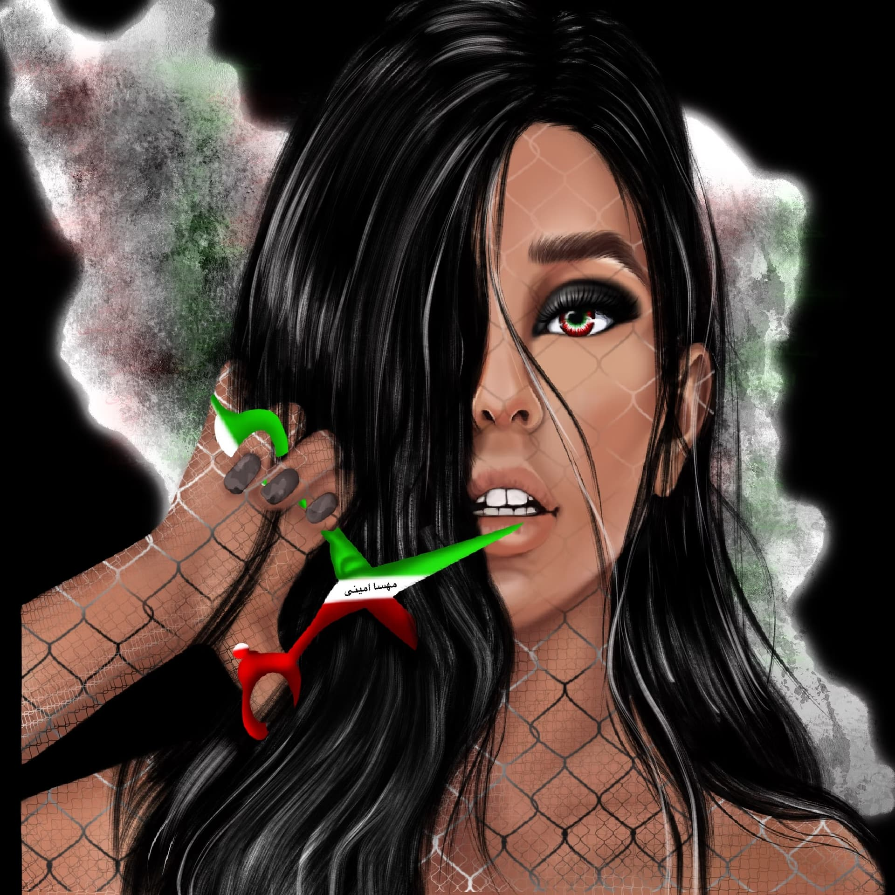

# supporting iranian nft artists

*Original topic from 2023-09-19T09:00:40Z*

### Original Post
**Author:** root | 2023  
**Date:** 03-27 03:10:42 UTC | #1  

This grant is intended to support Iranian NFT artists. The grant pool will go towards purchasing authentic digital art NFTs from Iranian artists, providing patronage and promotion for the Iranian digital artist community. The NFT art purchased will be held by the IranUnchained DAO, and used for branding. The DAO will then gift these NFTs, at our discretion, as rewards to honour our allies who make meaningful contributions to advancing the cause of Iranian freedom.

--------------

# **Supporting Iranian NFT Artists**

Thousands of Iranian artists have been producing incredible unique 1:1 artworks and selling them for ETH on NFT marketplaces on Ethereum. Through their art, these Iranian artists are able to express the full range of their revolutionary experience: the misery of personal loss, aspirations for freedom, resilience in the face of oppression, and visions of a better life. This grant pool will go towards purchasing authentic digital art NFTs from Iranian artists, providing patronage and promotion for the Iranian digital artist community.

Our target spend per artwork will be ~$2-500 per piece, with exceptions made for truly remarkable artworks.

Curators will include members of the IranUnchained DAO, as well as [Roya](https://twitter.com/_r0yart).

The NFT art purchased will be held by the IranUnchained DAO, and used for branding. The DAO will then gift these NFTs, at our discretion, as rewards to honor our allies who make meaningful contributions to advancing the cause of Iranian freedom.

The DAO already has a small collection of Iranian NFT art, and we hope to grow it. This past Christmas, one member of IranUnchained went shopping for NFT art by Iranian artists and was blown away by the number of artists and the quality of the art. They [purchased several artworks](https://twitter.com/ameensol/status/1607460199115403264), which have since been donated to the DAO. Our full NFT art collection can be seen on our [IranUnchained.eth profile](https://foundation.app/0xDe1E21B33a6E11810f8321409d80b55EcC645E4a). The cover picture for this grant proposal is one such NFT, created by an Iranian artist and donated to IranUnchained.

Regarding the legality of our IranUnchained purchasing art from Iranians, OFAC has historically included art in the “informations materials” under the Berman exemptions, as long as the art is not high value ($100K) that is being used for money laundering. Please see our [Legal Primer](https://medium.com/@iranunchained/iran-aid-a-legal-primer-ede9e8f4826d) for more information.

In memory of [Mariam Salimian](https://twitter.com/mariamsalimian).

---

### Reply #1
**Author:** root | 2023  
**Date:** 03-27 22:03:57 UTC | #2  

Deployed: 
https://www.iranunchained.com/grants/bafkreig4ly3dhe42yilvkb33fp62r7clyhplcy27aa7wi2lwbvglouq4o4/details

---

### Reply #2
**Author:** root | 2023  
**Date:** 04-11 19:24:18 UTC | #3  

As discussed on **[Core member's office](https://forum.iranunchained.com/t/nft-grant-curation-round-1/39)**, Call for applicant is sent out and we are gathering NFT candidates. please share:

- https://twitter.com/UnchainIran/status/1645869081403465729

- https://twitter.com/UnchainIran/status/1645869084590895106

---

### Reply #3
**Author:** root | 2023  
**Date:** 04-26 03:34:18 UTC | #4  

Proposal sent for voting for _Transfer to working group wallet_:  https://admin.daohaus.fun/#/molochV3/0x1/0x81db04dfd741a765eae4696643c3bb558e7ac3b4/proposals/7

---

### Reply #4
**Author:** root | 2023  
**Date:** 05-18 16:08:57 UTC | #5  

The first round of NFTs (28) has been purchased. The NFTs will be transferred to IranUnchained DAO treasury in the coming week and the NFTs will be showcased on Twitter and also in the first round of grants blog post.

---

### Reply #5
**Author:** root | 2023  
**Date:** 06-02 23:43:24 UTC | #6  

The first round of this grant is wrapped up. Congradulations to all the winners and thanks to all applicants. 

Twitter Announcement: https://twitter.com/UnchainIran/status/1664038669026484226

All NFTs can be seen on the DAO's treasury address: https://foundation.app/0xDe1E21B33a6E11810f8321409d80b55EcC645E4a

The fundraising will continue and second round will begin when enough funds are deposited to the grant.

---

### Reply #6
**Author:** ameen | 2023  
**Date:** 09-19 09:01:03 UTC | #7  

Funds have been deposited for round 2, and we are starting to curate good art in anticipation of our next purchases.

---

