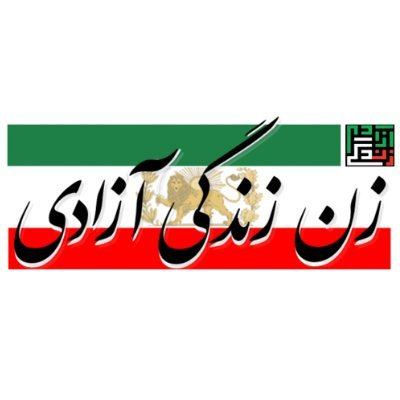

# zan zendegi azadi newsletter

*Original topic from 2023-05-18T16:08:06Z*

### Original Post
**Author:** root | 2023  
**Date:** 05-18 16:09:35 UTC | #1  

This fund is meant to promote the production of an independent news outlet that covers the latest ongoing political economic and social events of the Iranian Revolution.

-----------

# Woman, Life, Freedom daily newspaper

I am applying for a grant to support the publication of my electronic daily newspaper, "Woman, Life, Freedom" or "Zan, Zendegi, Azadi," in Farsi. The newsletter is published every day on our public Twitter account, Telegram channel, Instagram, and our website. Our publication is dedicated to providing our readers with accurate and reliable news, political, social, and economic analysis, and opinion pieces about the Iranian Revolution.

We believe that it is crucial for our readers to have access to trustworthy and comprehensive coverage of this important historical event. We take great care to ensure that all of our articles are fact-checked and corroborated by multiple sources before they are published.
The staff of the "Women Life Freedom" newspaper tirelessly dedicate many hours of their day and night to preparing this newspaper in order to provide a simpler platform for disseminating and broadcasting important news related to the Iranian people's revolution. One of our important goals has been to eliminate the obstacles to access for our compatriots (such as slow internet speeds) to the latest events related to the Iranian people's revolution.

 We are aware that in many small and large cities and villages throughout Iran, our compatriots print pages of the newspaper to the best of their ability and distribute it. While we applaud these compatriots, it also encourages us to have more confidence in our path and continue our work. Through our coverage of the Iranian Revolution, we aim to provide our readers with a deep understanding of the political, social, and economic factors that have contributed to this historic event. We believe that by providing a platform for informed debate and analysis, we can help to foster greater understanding and dialogue among our readers.

We rely on the support of grants and donations to fund our operations. We are, therefore, seeking a grant to support our coverage of the Iranian Revolution. With your support, we will be able to continue providing our readers with the reliable, unbiased coverage they have come to expect from our publication. It would also help us to publish an English version of our newsletter to help spread the voice of the Iranian Revolution to the world. We believe that our work is an essential component of a free and democratic society, and we are committed to upholding the highest standards of journalistic integrity in all of our reporting.
Thank you for considering our application.

Links:

- [https://twitter.com/zzanewspaper](https://twitter.com/zzanewspaper?s=21&t=Q1zAhd5iqQTGNeZjV8v67A)
- [https://t.me/zzanewspaper](https://t.me/zzanewspaper)
- [https://zzanewspaper.com/](https://zzanewspaper.com/)
- [https://instagram.com/zzanewspaper](https://instagram.com/zzanewspaper?igshid=YmMyMTA2M2Y=)

---

### Reply #1
**Author:** thessy | 2023  
**Date:** 03-17 20:54:35 UTC | #2  

re: ZZA Newsletter... proposing it to be bi-lingual. for Iran, but also for the rest of the world to see what the news are. We have to start communicating across ...this is a problem right now in protests and socials that most of the info is in farsi... journalists don't speak it, I don't and even for greater transparency bi-lingual would be important. :pray:

---

### Reply #2
**Author:** root | 2023  
**Date:** 03-27 22:05:22 UTC | #3  

Deployed: 
https://www.iranunchained.com/grants/bafkreicoyfx63pjn3lrdndmqxxhhke64sfoxaa774t2bmigqm3nj7bja2y/details

---

### Reply #3
**Author:** root | 2023  
**Date:** 05-18 16:08:06 UTC | #4  

The funds has been distributed to ZZA. Blog post update coming soon.

---

